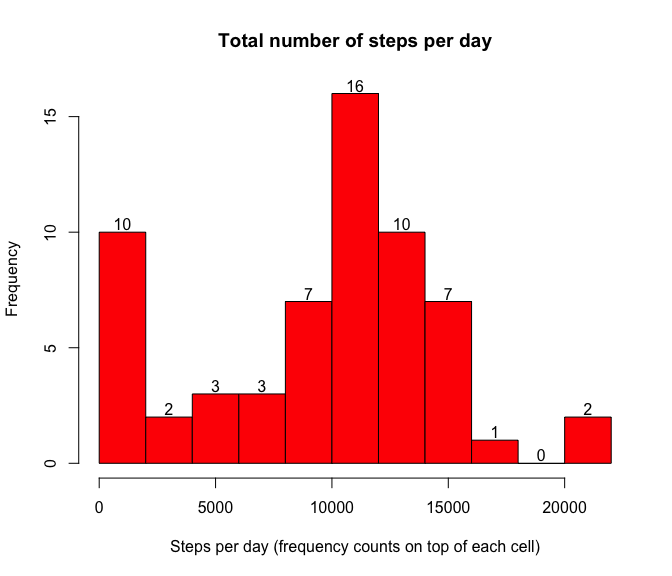
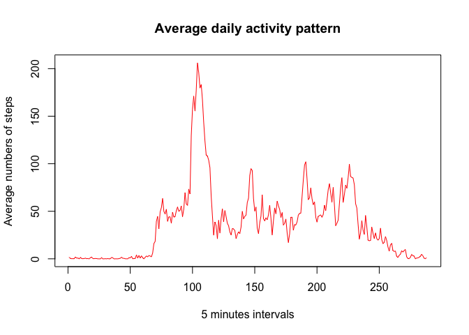

# Reproducible Research: Peer Assessment 1
TZiegler  
16. Dezember 2015  


```r
library(knitr)
```


## Loading and preprocessing the data
This step extracts the given zip file, loads the csv file, checks it and converts the date data into real date format for further analysis.


```r
## Exctract zipfile
unzip("activity.zip")

activity <- read.csv("activity.csv")
```

Get an owverview of the data.

```r
## Show structure of data frame
str(activity)
```

```
## 'data.frame':	17568 obs. of  3 variables:
##  $ steps   : int  NA NA NA NA NA NA NA NA NA NA ...
##  $ date    : Factor w/ 61 levels "2012-10-01","2012-10-02",..: 1 1 1 1 1 1 1 1 1 1 ...
##  $ interval: int  0 5 10 15 20 25 30 35 40 45 ...
```

```r
## Show summary
summary(activity)
```

```
##      steps                date          interval     
##  Min.   :  0.00   2012-10-01:  288   Min.   :   0.0  
##  1st Qu.:  0.00   2012-10-02:  288   1st Qu.: 588.8  
##  Median :  0.00   2012-10-03:  288   Median :1177.5  
##  Mean   : 37.38   2012-10-04:  288   Mean   :1177.5  
##  3rd Qu.: 12.00   2012-10-05:  288   3rd Qu.:1766.2  
##  Max.   :806.00   2012-10-06:  288   Max.   :2355.0  
##  NA's   :2304     (Other)   :15840
```

Convert date values to Date format

```r
activity$date <- as.Date(activity$date)
```


## What is mean total number of steps taken per day?
For this part the missing values in the dataset can be ignored.

1. Calculate the total number of steps taken per day.

```r
dailysteps <- aggregate(activity$steps, by=list(activity$date), FUN=sum, na.rm = TRUE)

## Replace generic column names with new ones
names(dailysteps) <- c('day', 'totalsteps')

kable(dailysteps, format = "pandoc", col.names = c("Date","Total steps"), format.args = list(big.mark = ','))
```


Date          Total steps
-----------  ------------
2012-10-01              0
2012-10-02            126
2012-10-03         11,352
2012-10-04         12,116
2012-10-05         13,294
2012-10-06         15,420
2012-10-07         11,015
2012-10-08              0
2012-10-09         12,811
2012-10-10          9,900
2012-10-11         10,304
2012-10-12         17,382
2012-10-13         12,426
2012-10-14         15,098
2012-10-15         10,139
2012-10-16         15,084
2012-10-17         13,452
2012-10-18         10,056
2012-10-19         11,829
2012-10-20         10,395
2012-10-21          8,821
2012-10-22         13,460
2012-10-23          8,918
2012-10-24          8,355
2012-10-25          2,492
2012-10-26          6,778
2012-10-27         10,119
2012-10-28         11,458
2012-10-29          5,018
2012-10-30          9,819
2012-10-31         15,414
2012-11-01              0
2012-11-02         10,600
2012-11-03         10,571
2012-11-04              0
2012-11-05         10,439
2012-11-06          8,334
2012-11-07         12,883
2012-11-08          3,219
2012-11-09              0
2012-11-10              0
2012-11-11         12,608
2012-11-12         10,765
2012-11-13          7,336
2012-11-14              0
2012-11-15             41
2012-11-16          5,441
2012-11-17         14,339
2012-11-18         15,110
2012-11-19          8,841
2012-11-20          4,472
2012-11-21         12,787
2012-11-22         20,427
2012-11-23         21,194
2012-11-24         14,478
2012-11-25         11,834
2012-11-26         11,162
2012-11-27         13,646
2012-11-28         10,183
2012-11-29          7,047
2012-11-30              0


2. Make a histogram of the total number of steps taken each day.

```r
h <- hist(dailysteps$totalsteps, breaks = 15, main = "Total number of steps per day", col = "red", xlab = "Steps per day (frequency counts on top of each cell)")

## Add the frequency counts above each cell
text(h$mids,h$counts,labels=h$counts, adj=c(0.5, -0.2))
```

 

3. Calculate and report the mean and median of the total number of steps taken per day

```r
steps_mean <- round(mean(dailysteps$totalsteps,na.rm=TRUE),2)
steps_median <- median(dailysteps$totalsteps, na.rm = TRUE)
```
- The mean of the total number of steps taken per day is **9354.23**
- The median of the total number of steps taken per day is **10395**


## What is the average daily activity pattern?
1. Make a time series plot (i.e. type = "l") of the 5-minute interval (x-axis) and the average number of steps taken, averaged across all days (y-axis)


```r
avsteps <- tapply(activity$steps, activity$interval, FUN=mean, na.rm = TRUE)
plot(avsteps, type='l', col='red',main="Average daily activity pattern",xlab="5 minutes intervals",ylab="Average numbers of steps")
```

 
A day has 288 of 5-minute intervals. 

2. Which 5-minute interval, on average across all the days in the dataset, contains the maximum number of steps?

```r
max_interval <- which(avsteps %in% max(avsteps))
```
The 5-minute interval with the maximum number of steps is interval **104** with an average number of  206.17 steps.


## Imputing missing values
Note that there are a number of days/intervals where there are missing values (coded as NA). The presence of missing days may introduce bias into some calculations or summaries of the data.

1. Calculate and report the total number of missing values in the dataset (i.e. the total number of rows with NAs)


## Are there differences in activity patterns between weekdays and weekends?
